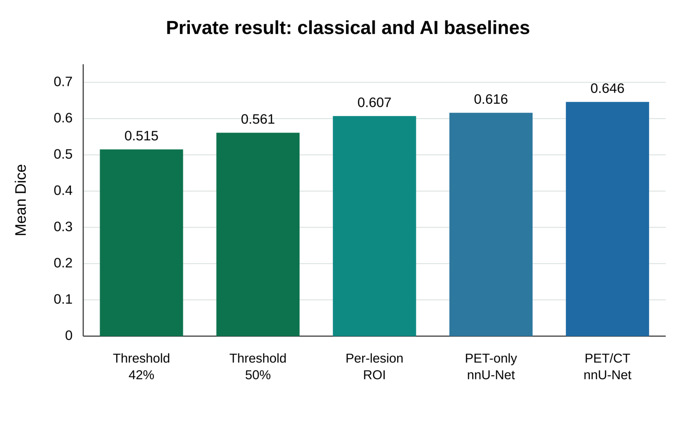
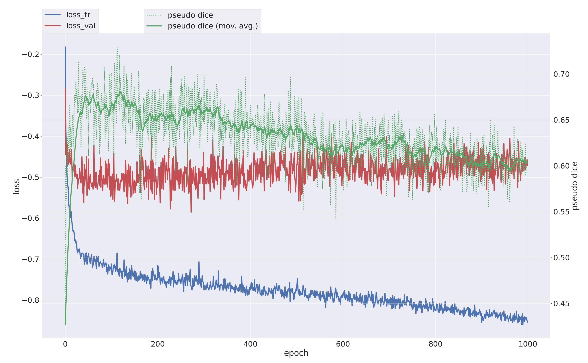
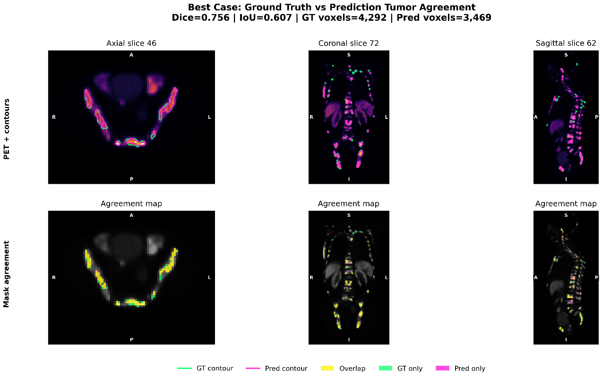
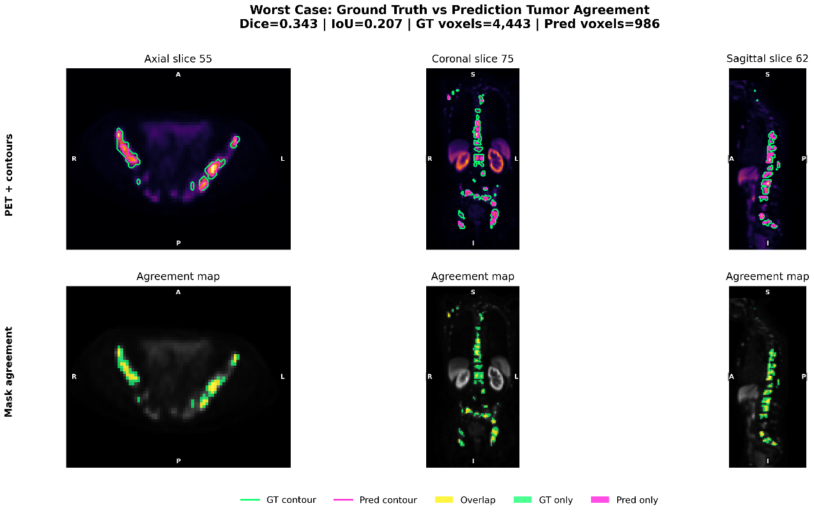

# PSMA PET/CT Tumour Segmentation with nnU-Net v2

> Final-year B.Sc. project — automated tumour segmentation in whole-body
> ¹⁸F-PSMA PET/CT imaging, evaluated on public and private datasets.
> **Author:** Aung Minn Khant, University of Macau · **Supervisor:** Prof. Greta Seng Peng Mok



## What this project is

Manual tumour delineation in whole-body PET/CT requires slice-by-slice outlining
by a specialist — slow, expensive, and hard to reproduce. This project evaluates
whether a deep-learning pipeline can do it automatically, and how far a model
trained on public data transfers to a private clinical dataset.

This repository is a **project showcase**: it documents the experiments,
engineering decisions, and results. The full pipeline code is included for
transparency and reproducibility — raw medical images, trained checkpoints, and
private case identifiers are intentionally not distributed.

## What was actually done

- **Six segmentation approaches compared head-to-head**: classical SUV
  thresholding (42% / 50%), whole-body 3D nnU-Net, union-of-lesions ROI
  cropping, lesion-centred cropping, PET-only input, and a residual-encoder
  preset.
- **Transfer learning**: pre-trained on the public AutoPET ¹⁸F-PSMA dataset
  (369 cases), fine-tuned on the private 5 mm dataset — closing most of the
  domain gap (+0.23 mean Dice over zero-shot transfer).
- **1,000-epoch 3D full-resolution nnU-Net v2 training runs**, five-fold
  cross-validation per experiment, on NVIDIA A100 80GB and RTX A6000 GPUs.
- **Fixed held-out test sets** — no tuning on test data; every reported number
  is from cases the model never saw during training.
- **Clinical sanity checks**: SUVmax / SUVmean agreement between predicted and
  ground-truth masks, plus voxel-level failure analysis in ITK-SNAP.



## Results

All metrics on held-out / external test cases.

| Experiment | Model | Mean Dice | Mean IoU | Mean HD95 (mm) |
|---|---:|---:|---:|---:|
| Public whole-body external test | 5-fold ensemble | 0.6218 | 0.4848 | 69.02 |
| Public union-ROI external test | Fold 0 | 0.6518 | 0.5118 | 33.21 |
| Private whole-body held-out test | Fold 0 | 0.6214 | 0.4656 | 31.93 |
| Public-to-private transfer held-out test | 5-fold ensemble | 0.6419 | 0.4834 | 32.03 |
| Private lesion-ROI held-out lesion test | Fold 0 | 0.6070 | 0.4929 | 24.98 |

The PET/CT nnU-Net five-fold ensemble was the strongest practical approach —
beating the best classical threshold baseline (0.646 vs 0.561 mean Dice) while
requiring no prior knowledge of lesion location. See
[results/RESULTS.md](results/RESULTS.md) for every fold and the audit
qualifications. This is research code and is not a medical device.

## Qualitative results

Ground truth (green) vs prediction (magenta) contours and voxel-level agreement
maps in axial, coronal, and sagittal views, from the private held-out test set.

**Best whole-patient case** (Dice 0.756, IoU 0.607):



**Difficult failure case** (Dice 0.343, IoU 0.207) — the model under-segments
extensive diffuse disease; good localization in high-uptake regions, weaker
boundary coverage:



## Key engineering findings

- **Patient-grouped splitting matters.** Lesion-level splits placed crops from
  the same patient in both train and validation, inflating validation scores.
  The split generator in this repo groups by patient.
- **Channel order is easy to get wrong and hard to notice.** One private
  experiment silently inherited a CT/PET file order while declaring PET/CT —
  caught via a near-zero Dice audit, fixed by physically swapping input
  channels during conversion.
- **Physical coordinates must survive cropping.** ROI crops initially lost
  their true origin after symmetric padding; the final implementation uses
  `TransformIndexToPhysicalPoint` with the padded start index.
- [docs/RECOVERY_AUDIT.md](docs/RECOVERY_AUDIT.md) documents every correction
  and exclusion in full.

## Repository contents

- `scripts/` — dataset preparation, ROI dataset building, deterministic
  patient-grouped five-fold splits, nnU-Net v2 train/preprocess/predict
  wrappers, and per-case evaluation (Dice, IoU, precision, recall, HD95).
- `configs/` — every PSMA dataset definition and experiment record.
- `results/` — aggregate, identifier-free metrics (CSV + summary tables).
- `src/psma_nnunet/` — metric and ROI utilities with unit tests.
- `docs/REPRODUCIBILITY.md` — end-to-end commands for rerunning the pipeline.
- CI runs the unit tests on every push.

## Reproducing the pipeline

Runtime: Python 3.10, PyTorch 2.5.1, CUDA 12.1, nnU-Net v2.6.4.

```bash
python3.10 -m venv .venv
source .venv/bin/activate
python -m pip install --upgrade pip==25.0.1
python -m pip install torch==2.5.1 torchvision==0.20.1 --index-url https://download.pytorch.org/whl/cu121
python -m pip install -r requirements.txt
python -m pip install -e .
```

Then set the three nnU-Net paths and follow
[docs/REPRODUCIBILITY.md](docs/REPRODUCIBILITY.md). You will need your own
PSMA PET/CT data in nnU-Net raw format — the datasets used here are not
redistributed.

## Citation

If this code is used in research, cite nnU-Net:

> Isensee F, Jaeger PF, Kohl SAA, Petersen J, Maier-Hein KH. nnU-Net: a
> self-configuring method for deep learning-based biomedical image segmentation.
> Nature Methods. 2021;18:203-211.

## License

The project code is released under the MIT License. nnU-Net and the datasets
retain their respective licenses and terms of use.
